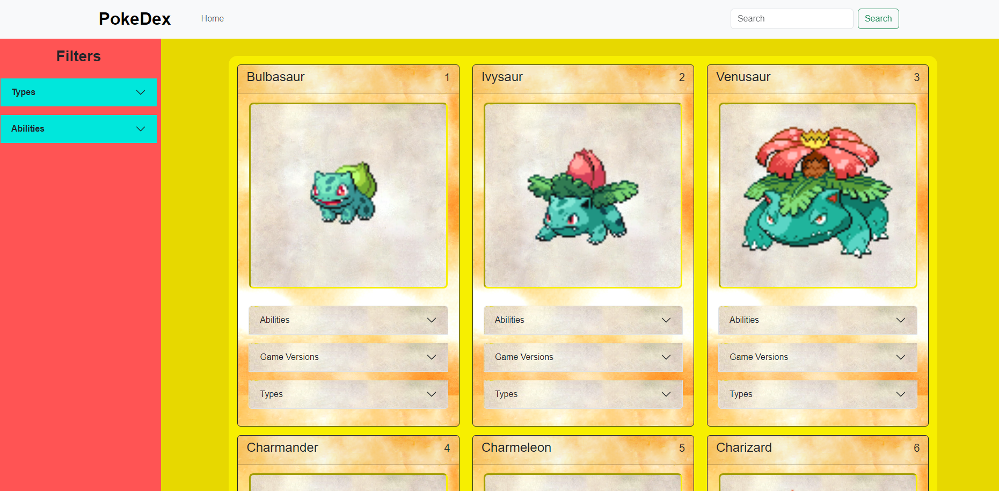
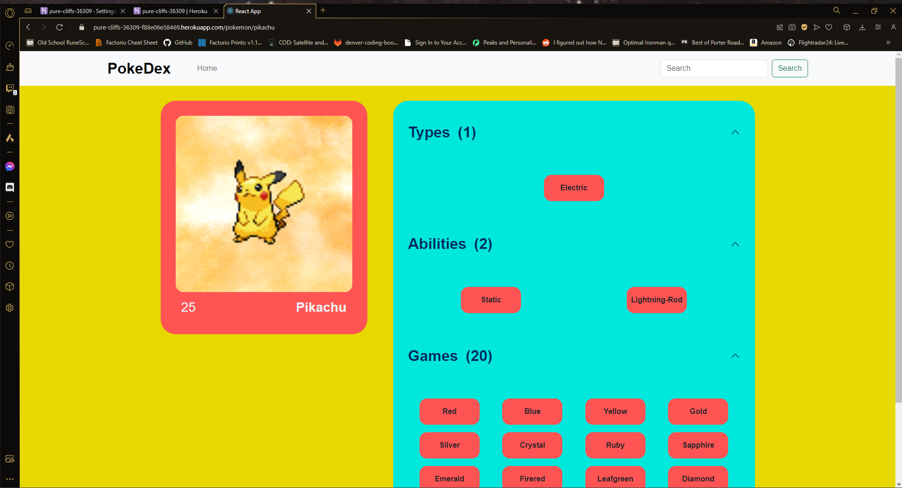

# Pokemon-Encyclopedia

## Description

This application is an encyclopedia of Pokemon that shows some statistics for each Pokemon. 

## Table of Contents

[Install][#install]
[Overview][#overview]
[Screenshots][#screenshots]
[Links][#links]

## Install
To run the application locally: 
1. Clone the repository from: git@github.com:JacobYaws/Pokemon-Encyclopedia.git
2. Install dependencies in the app's root directory through a git CLI: 'npm install'
3. Seed the database:
    - To avoid making multiple unnecessary calls to the external API, I created a database for the app and seeded it with the data that would come back from the API. I currently have the first generation in the database.
    - I created code to consume the external API and then create a JSON file with the returned data. I used the endpoint from https://pokeapi.co/docs/v2#generations to get the pokemon name and ID and then used that data with the endpoint from https://pokeapi.co/docs/v2#pokemon to get more data for each pokemon. 
    - Once the JSON files are created, you will be able to seed the database.
4. Run npm start from the app's root directory in the git CLI.

## Overview

- This app is a MERN application. GraphQL and Apollo are used for making database queries from the front-end.
- Filters will sort the list by what is selected first and then each filter selected afterwards will show any Pokemon that contains the selected filter attribute.
- Each Pokemon card image can be clicked and doing so will take the user to that Pokemon's stat page.  

## Screenshots

## Links

-Github: https://github.com/JacobYaws/Pokemon-Encyclopedia

-Deployed Site: https://pure-cliffs-36309-f88e06e58469.herokuapp.com